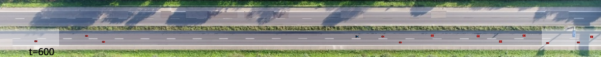

## Run Realistic Benchmark
<p>

</p>

### Step1: Setup CommonRoad (for realistic environments)

[//]: # (Our realistic environments are based on the [commonroad-rl]&#40;https://gitlab.lrz.de/tum-cps/commonroad-rl.git&#41; environment, for which we provide two options:)

[//]: # (#### Option 1: Use our implementation)

[//]: # (You don't need to do anything, but our code is not based on the latest implementation of [commonroad-rl]&#40;https://gitlab.lrz.de/tum-cps/commonroad-rl.git&#41;.)

[//]: # ()
[//]: # (#### Option 2: Use the lastest implementation in CommonRoad RL)

[//]: # (You need to set up CommonRoad by following the instructions in [commonroad-rl]&#40;https://gitlab.lrz.de/tum-cps/commonroad-rl.git&#41;:)

[//]: # ()
[//]: # (- Download the environment)

[//]: # (```)

[//]: # (rm -rf ./commonroad_environment/)

[//]: # (git clone https://gitlab.lrz.de/tum-cps/commonroad-rl.git)

[//]: # (mv commonroad-rl/ commonroad_environment/)

[//]: # (cd commonroad_environment/)

[//]: # (```)

[//]: # ()
[//]: # (- Install build packages and submodules)

```
sudo apt-get update
sudo apt-get install build-essential make cmake

# option 1: Install with sudo rights (cn-py37 is the name of conda environment).
cd ./commonroad_environment
bash ./scripts/install.sh -e cn-py37

# Option 2: Install without sudo rights
bash ./commonroad_environment/scripts/install.sh -e cn-py37 --no-root
```

[//]: # (git submodule update --recursive || exit_with_error "Update submodules failed")

[//]: # (```)

[//]: # (- Install with sudo rights &#40;Check [commonroad-rl]&#40;https://gitlab.lrz.de/tum-cps/commonroad-rl.git&#41; about installing **without** sudo rights&#41;)

[//]: # (```)

[//]: # (bash scripts/install.sh -e cn-py37)

[//]: # (```)

[**For Running with the Full HighD Data Only**] Get the full dataset and Preprocess.  
- Our repository uses some data examples from [commonroad-rl tutorial](https://gitlab.lrz.de/tum-cps/commonroad-rl/-/tree/master/commonroad_rl/tutorials/data). To build the full environments, you need to apply for the HighD dataset from [here](https://www.highd-dataset.com/). **The dataset is free for not non-commercial use**.
- After you receive the data, do some preprocess according to [Tutorial 01 - Data Preprocessing](https://gitlab.lrz.de/tum-cps/commonroad-rl/-/blob/master/commonroad_rl/tutorials/Tutorial%2001%20-%20Data%20Preprocessing.ipynb). We show a brief version as follow:  

Once you have downloaded the data, extract all the .csv (e.g., `03_recordingMeta.csv`, `03_tracks.csv`, `03_tracksMeta.csv`) files to the folder`CIRL-benchmarks-public/data/highD/raw/data/`, and then
```
cd ./commonroad_environment/install/

# install python packages
cd ./dataset-converters
pip install -r requirements.txt

# transfer raw data to .xml files
python -m src.main highD ../../../data/highD/raw/ ../../../data/highD/xmls/ --num_time_steps_scenario 1000

# compute the .pickle files
cd $YourProjectDir/CIRL-benchmarks-public/commonroad_environment/commonroad_rl
python -m commonroad_rl.tools.pickle_scenario.xml_to_pickle -i ../../data/highD/xmls -o ../../data/highD/pickles

# split the dataset
python -m commonroad_rl.utils_run.split_dataset -i ../../data/highD/pickles/problem -otrain ../../data/highD/pickles/problem_train -otest ../../data/highD/pickles/problem_test -tr_r 0.7

# scatter dataset for multiple processes
python -m commonroad_rl.tools.pickle_scenario.copy_files -i ../../data/highD/pickles/problem_train -o ../../data/highD/pickles/problem_train_split -f *.pickle -n 5
```

###  Step 3: Run the algorithms
[//]: # (![GitHub Logo]&#40;./images&others/highdenv.png&#41;)

1. The HighD Velocity Constraint 
```
cd ./interface/

# run PPO
python train_ppo.py ../config/highD_velocity_constraint/train_ppo_highD_velocity_constraint.yaml -n 5 -s 123

# run PPO-Lag
python train_ppo.py ../config/highD_velocity_constraint/train_ppo_lag_highD_velocity_constraint.yaml -n 5 -s 123

# run GACL
python train_gail.py ../config/highD_velocity_constraint/train_GAIL_highd_velocity_constraint.yaml -n 5 -s 123

# run BC2L
python train_cirl.py ../config/highD_velocity_constraint/train_Binary_highD_velocity_constraint.yaml -n 5 -s 123

# run MECL
python train_cirl.py ../config/highD_velocity_constraint/train_ICRL_highD_velocity_constraint.yaml -n 5 -s 123

# run VICRL
python train_cirl.py ../config/highD_velocity_constraint/train_VICRL_highD_velocity_constraint.yaml -n 5 -s 123
```

2. The HighD Velocity Constraint simplified 
```
cd ./interface/

# run GACL
python train_gail.py ../config/highD_velocity_constraint/train_GAIL_highd_velocity_constraint_simplified.yaml -n 5 -s 123

# run BC2L
python train_cirl.py ../config/highD_velocity_constraint/train_Binary_highD_velocity_constraint_simplified.yaml -n 5 -s 123

# run MECL
python train_cirl.py ../config/highD_velocity_constraint/train_ICRL_highD_velocity_constraint_simplified.yaml -n 5 -s 123

# run VICRL
python train_cirl.py ../config/highD_velocity_constraint/train_VICRL_highD_velocity_constraint_simplified.yaml -n 5 -s 123
```

3. The HighD Distance Constraint 
```
cd ./interface/

# run PPO
python train_ppo.py ../config/highD_distance_constraint/train_ppo_highD_distance_constraint.yaml -n 5 -s 123

# run PPO-Lag
python train_ppo.py ../config/highD_distance_constraint/train_ppo_lag_highD_distance_constraint.yaml -n 5 -s 123

# run GACL
python train_gail.py ../config/highD_distance_constraint/train_GAIL_highD_distance_constraint.yaml -n 5 -s 123

# run BC2L
python train_cirl.py ../config/highD_distance_constraint/train_Binary_highD_distance_constraint.yaml -n 5 -s 123

# run MECL
python train_cirl.py ../config/highD_distance_constraint/train_ICRL_highD_distance_constraint.yaml -n 5 -s 123

# run VICRL
python train_cirl.py ../config/highD_distance_constraint/train_VICRL_highD_distance_constraint.yaml -n 5 -s 123
```

4. The HighD Distance Constraint simplified 
````
cd ./interface/

# run GACL
python train_gail.py ../config/highD_distance_constraint/train_GAIL_highD_distance_constraint_simplified.yaml -n 5 -s 123

# run BC2L
python train_cirl.py ../config/highD_distance_constraint/train_Binary_highD_distance_constraint_simplified.yaml -n 5 -s 123

# run MECL
python train_cirl.py ../config/highD_distance_constraint/train_ICRL_highD_distance_constraint_simplified.yaml -n 5 -s 123

# run VICRL
python train_cirl.py ../config/highD_distance_constraint/train_VICRL_highD_distance_constraint_simplified.yaml -n 5 -s 123
```

