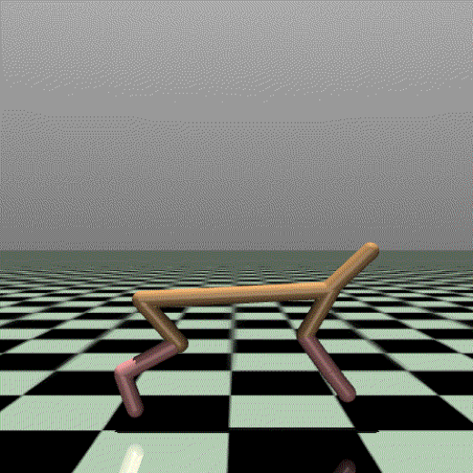
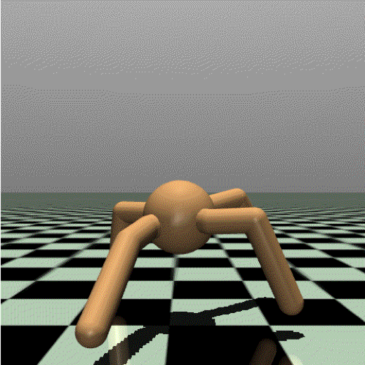
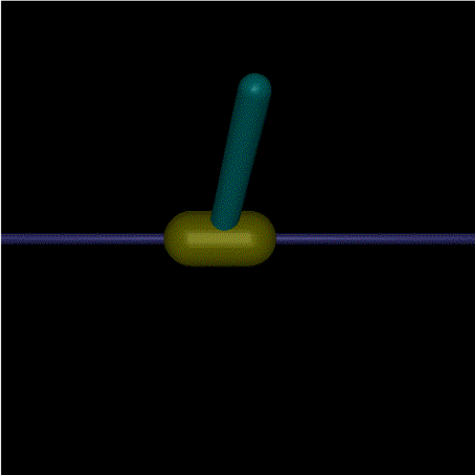
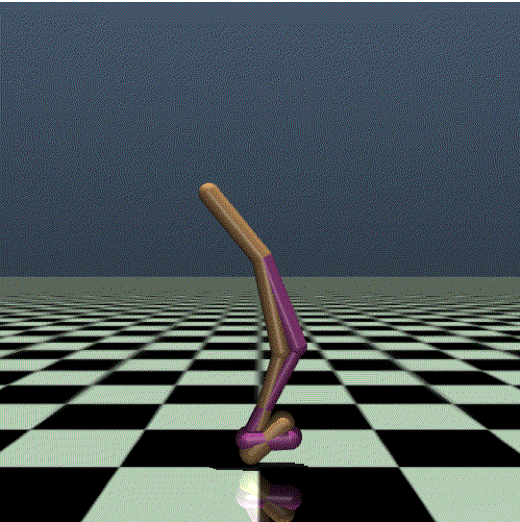
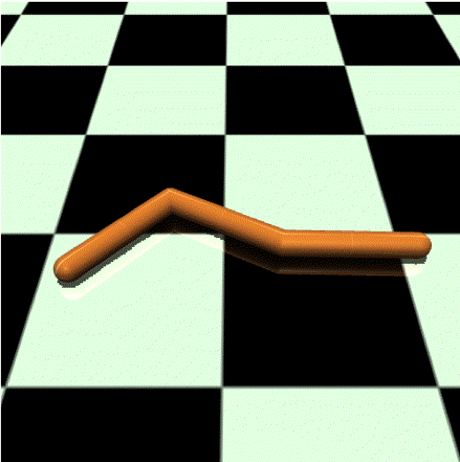

## Run Virtual Benchmark
<p>





</p>

###  Step 1: Setup MuJoCo (for virtual environments)
To run the virtual environment, you need to set up MuJoCo.
1. Download the MuJoCo version 2.1 binaries for Linux or OSX. 
2. Extract the downloaded mujoco210 directory into ~/.mujoco/mujoco210.
3. Install and use [mujoco-py](https://github.com/openai/mujoco-py).
```
pip install -U 'mujoco-py<2.2,>=2.1'
pip install -e ./mujuco_environment
```
We **highly recommend** you to ensure the MuJoCo is indeed working by running testing examples in [mujoco-py](https://github.com/openai/mujoco-py). In most case, you need to run:
```
import mujoco_py
import os
mj_path = mujoco_py.utils.discover_mujoco()
xml_path = os.path.join(mj_path, 'model', 'humanoid.xml')
model = mujoco_py.load_model_from_path(xml_path)
sim = mujoco_py.MjSim(model)
```

### Important Notice
Throughout this section, we will use the ```Blocked Half-cheetah``` environment as an example, 
for using other environments (including ```Blocked Ant```, ```Biased Pendulumn```, ```Blocked Walker```, and ```Blocked Swimmer```, please refer to their configs in this [dir](./config/))

###  Step 2 (optionally): Train expert agents.
Note that the expert agent is to generate demonstration data (see the step 3 below).
```
# step in the dir containing the "main" files.
cd ./interface/

# run PPO without knowing the constraint
python train_policy.py ../config/mujuco_BlockedHalfCheetah/train_ppo_HCWithPos-v0.yaml -n 5 -s 123

# run PPO-Lag knowing the ground-truth
python train_policy.py ../config/mujuco_BlockedHalfCheetah/train_ppo_lag_HCWithPos-v0.yaml -n 5 -s 123
```

###  Step 3 (optionally): Generate the expert demonstration.
Note that:
1. you don't need to generate expert demonstrations since they are provided, 
but if you want to test other types of expert demonstrations, here is the code to start from:
2. Since the generation relies on expert agent, we provide an example to you (named ```train_ppo_lag_HCWithPos-v0-multi_env-Apr-21-2022-04:49-seed_123```).
```
# step in the dir containing the "main" files.
cd ./interface/

# run data generation
python generate_data_for_constraint_inference.py -n 5 -mn train_ppo_lag_HCWithPos-v0-multi_env-Apr-21-2022-04:49-seed_123 -tn PPO-Lag-HC -ct no-constraint -rn 1
```

### Step 4: Run the ICLR algorithms under regular settings
We use the ```Blocked Half-Cheetah``` environment as an example (also see the notice above).
Note that:
1. This is to reproduce the results in the Section 4.2 of our paper. 
2. The following code uses the random seed '123'. For reproduction, a total of 5 random seeds ('123', '321', '456', '654', '666') are required.
```
# step in the dir containing the "main" files.
cd ./interface/

# run GACL
python train_gail.py ../config/mujuco_BlockedHalfCheetah/train_GAIL_HCWithPos-v0.yaml -n 5 -s 123

# run BC2L
python train_icrl.py ../config/mujuco_BlockedHalfCheetah/train_Binary_HCWithPos-v0.yaml -n 5 -s 123

# run MECL
python train_icrl.py ../config/mujuco_BlockedHalfCheetah/train_ICRL_HCWithPos-v0.yaml -n 5 -s 123

# run VICRL
python train_icrl.py ../config/mujuco_BlockedHalfCheetah/train_VICRL_HCWithPos-v0.yaml -n 5 -s 123
```

### Step 5: Run the ICLR algorithms under sub-optimal demonstration
Note that:
1. This is to reproduce the results in the Section 4.3 of our paper. 
2. The following code uses the random seed '123'. For reproduction, a total of 5 random seeds ('123', '321', '456', '654', '666') are required.
```
# step in the dir containing the "main" files.
cd ./interface/

# run GACL with 20%/50%/80% sub-optimal trajectories
python train_gail.py ../config/mujuco_HCWithPos-v0/train_GAIL_HCWithPos-v0_sub-2e-1.yaml -n 5 -s 123
python train_gail.py ../config/mujuco_HCWithPos-v0/train_GAIL_HCWithPos-v0_sub-5e-1.yaml -n 5 -s 123
python train_gail.py ../config/mujuco_HCWithPos-v0/train_GAIL_HCWithPos-v0_sub-8e-1.yaml -n 5 -s 123

# run Binary with 20%/50%/80% sub-optimal trajectories
python train_icrl.py ../config/mujuco_HCWithPos-v0/train_Binary_HCWithPos-v0_sub-2e-1.yaml -n 5 -s 123
python train_icrl.py ../config/mujuco_HCWithPos-v0/train_Binary_HCWithPos-v0_sub-5e-1.yaml -n 5 -s 123
python train_icrl.py ../config/mujuco_HCWithPos-v0/train_Binary_HCWithPos-v0_sub-8e-1.yaml -n 5 -s 123

# run MECL with 20%/50%/80% sub-optimal trajectories
python train_icrl.py ../config/mujuco_HCWithPos-v0/train_ICRL_HCWithPos-v0_sub-2e-1.yaml -n 5 -s 123
python train_icrl.py ../config/mujuco_HCWithPos-v0/train_ICRL_HCWithPos-v0_sub-5e-1.yaml -n 5 -s 123
python train_icrl.py ../config/mujuco_HCWithPos-v0/train_ICRL_HCWithPos-v0_sub-8e-1.yaml -n 5 -s 123

# run VCIRL with 20%/50%/80% sub-optimal trajectories
python train_icrl.py ../config/mujuco_HCWithPos-v0/train_VICRL_HCWithPos-v0_sub-2e-1.yaml -n 5 -s 123
python train_icrl.py ../config/mujuco_HCWithPos-v0/train_VICRL_HCWithPos-v0_sub-5e-1.yaml -n 5 -s 123
python train_icrl.py ../config/mujuco_HCWithPos-v0/train_VICRL_HCWithPos-v0_sub-8e-1.yaml -n 5 -s 123
```

### Step 5: Run the ICLR algorithms under stochastic demonstration
Note that:
1. This is to reproduce the results in the Section 4.3 of our paper. 
2. The following code uses the random seed '123'. For reproduction, a total of 5 random seeds ('123', '321', '456', '654', '666') are required.
```
# step in the dir containing the "main" files.
cd ./interface/

# run GACL with noise scale N(0,0.001), N(0,0.01), N(0,0.1)
python train_icrl.py ../config/mujuco_HCWithPos-v0/train_GAIL_HCWithPos-v0_noise-1e-3.yaml -n 5 -s 123
python train_icrl.py ../config/mujuco_HCWithPos-v0/train_GAIL_HCWithPos-v0_noise-1e-2.yaml -n 5 -s 123
python train_icrl.py ../config/mujuco_HCWithPos-v0/train_GAIL_HCWithPos-v0_noise-1e-1.yaml -n 5 -s 123

# run Binary with noise scale N(0,0.001), N(0,0.01), N(0,0.1)
python train_icrl.py ../config/mujuco_HCWithPos-v0/train_Binary_HCWithPos-v0_noise-1e-3.yaml -n 5 -s 123
python train_icrl.py ../config/mujuco_HCWithPos-v0/train_Binary_HCWithPos-v0_noise-1e-2.yaml -n 5 -s 123
python train_icrl.py ../config/mujuco_HCWithPos-v0/train_Binary_HCWithPos-v0_noise-1e-1.yaml -n 5 -s 123

# run ICRL with noise scale N(0,0.001), N(0,0.01), N(0,0.1)
python train_icrl.py ../config/mujuco_HCWithPos-v0/train_ICRL_HCWithPos-v0_noise-1e-3.yaml -n 5 -s 123
python train_icrl.py ../config/mujuco_HCWithPos-v0/train_ICRL_HCWithPos-v0_noise-1e-2.yaml -n 5 -s 123
python train_icrl.py ../config/mujuco_HCWithPos-v0/train_ICRL_HCWithPos-v0_noise-1e-1.yaml -n 5 -s 123

# run VICRL with noise scale N(0,0.001), N(0,0.01), N(0,0.1)
python train_icrl.py ../config/mujuco_HCWithPos-v0/train_VICRL_HCWithPos-v0_noise-1e-3.yaml -n 5 -s 123
python train_icrl.py ../config/mujuco_HCWithPos-v0/train_VICRL_HCWithPos-v0_noise-1e-2.yaml -n 5 -s 123
python train_icrl.py ../config/mujuco_HCWithPos-v0/train_VICRL_HCWithPos-v0_noise-1e-1.yaml -n 5 -s 123
```
